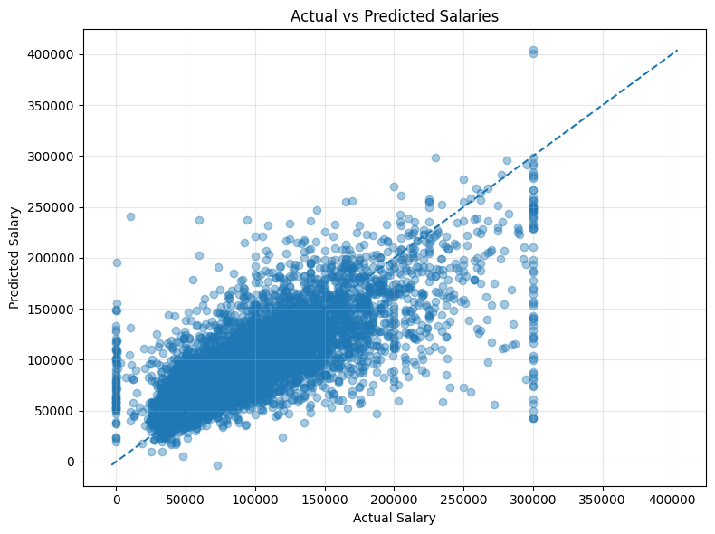
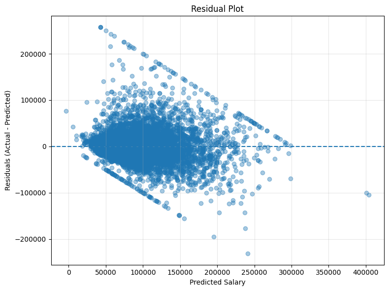
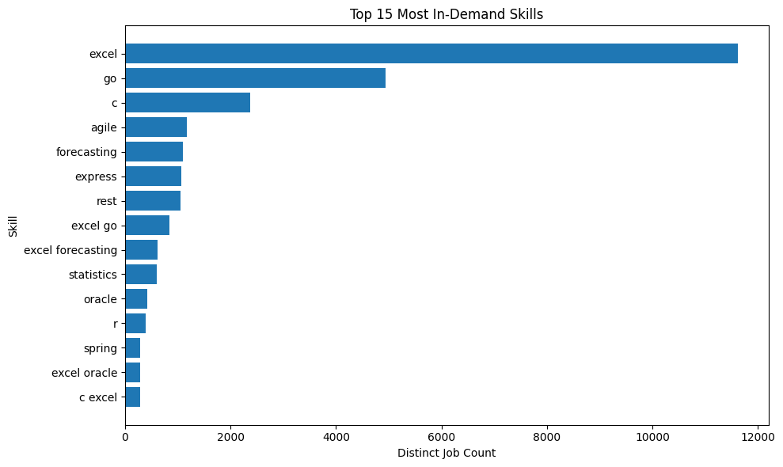
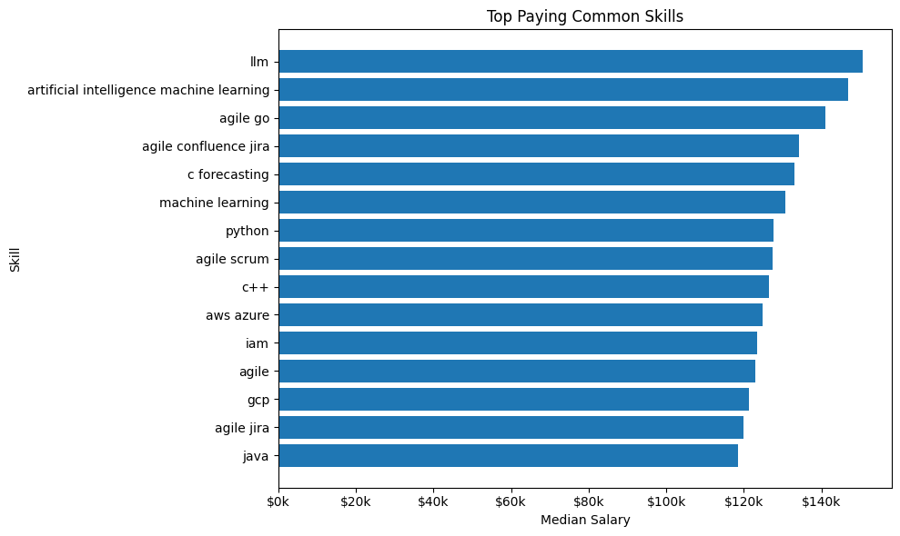
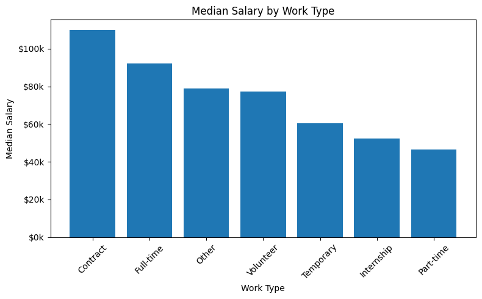

# AI Job Market Skill Analysis & Salary Intelligence

**Scalable NLP, Spark, and Machine Learning pipeline** to analyze technical job skills, demand patterns, and estimate salaries from large-scale job posting data.

---

## **Project Overview**

This project analyzes job postings to extract **technical skills**, identify **market demand trends**, discover **skill bundles**, and study how skills relate to **salary outcomes**.

The pipeline combines:

- **Natural Language Processing (spaCy)**
- **Distributed analytics (Apache Spark)**
- **Machine Learning (XGBoost)**

to efficiently process and analyze thousands of job listings.

---

## **Key Questions Answered**

- **What technical skills are most in demand?**
- **How do skill requirements vary by experience level?**
- **Which skills commonly appear together in job postings?**
- **Which skill combinations are associated with higher salaries?**
- **Can we estimate salaries for postings where compensation is not listed?**

---

## **Tech Stack**

- **Python**
- **spaCy** – NLP skill extraction
- **Apache Spark (PySpark)** – scalable aggregation
- **Pandas** – preprocessing and validation
- **scikit-learn** – feature encoding and evaluation
- **XGBoost** – salary estimation model
- **Parquet** – analytics-optimized storage

---

## **Dataset**

The dataset consists of structured job postings including:

- **Job title and description**
- **Company and location**
- **Extracted technical skills**
- **Normalized salary (when available)**
- **Work type** (full-time, part-time, contract, internship)
- **Experience level** (when available)

Many job postings do **not** list salary, motivating the **ML-based salary estimation** component.

---

## Pipeline Architecture

```text
Raw Job Postings (CSV)
        ↓
Data Cleaning (Pandas)
        ↓
Skill Extraction (spaCy)
        ↓
Skill Normalization & Explosion (Spark)
        ↓
Skill Demand & Bundle Analysis
        ↓
Salary & Skill Insights
        ↓
ML Salary Estimation (XGBoost)
```

## Data Cleaning 

- Removed invalid or incomplete records  
- Normalized and cleaned salary values  
- Replaced zero or invalid salaries with `NaN`  
- Deduplicated job postings using `job_id`  
- Prepared text fields for downstream NLP processing  

---

## Skill Extraction (spaCy)

- Built a curated technical skill lexicon  
- Used **spaCy PhraseMatcher** to extract atomic technical skills  
- Deduplicated skills per job using Python `set`s  

**Output schema:**
job_id | extracted_skills

```md
```python
from spacy.matcher import PhraseMatcher

matcher = PhraseMatcher(nlp.vocab, attr="LOWER")
matcher.add("SKILLS", skill_patterns)

doc = nlp(description)
extracted_skills = {
    doc[start:end].text.lower()
    for _, start, end in matcher(doc)
}
```
> Skills are extracted individually. Skill combinations are discovered later during analysis.

---

## Spark Skill Processing

- Loaded NLP output into Apache Spark  
- Split and exploded skill lists into long format  

**Schema:**
job_id | skill

```md
```python
from pyspark.sql import functions as F

df_long = (
    df
    .withColumn("skill", F.explode("extracted_skills"))
    .filter(F.col("skill").isNotNull())
    .select("job_id", "skill")
    .distinct()
)
```

- Removed null or empty skills  
- Enforced uniqueness defensively  
- Enabled scalable aggregation across large datasets  

---

## Skill Demand Analysis

Computed:
- Top technical skills overall  
- Skill demand by experience level  
- **Distinct job counts per skill** (not raw row counts)  

> Counting unique jobs prevents inflated demand metrics caused by duplicate rows.

---

## Skill Co-Occurrence (Skill Bundles)

Identified skills that frequently appear together within the same job posting.

**Methodology:**
1. Group skills by `job_id`  
2. Generate unique skill pairs per job  
3. Count co-occurrence across distinct jobs  

**Example output:**
skill_a | skill_b | job_count
python | sql | 15432
aws | docker | 11221
spark | aws | 10987

```md
```python
# Group unique skills per job
job_skills = (
    df_norm
    .filter(F.col("skill").isNotNull())
    .filter(F.trim(F.col("skill")) != "")
    .groupBy("job_id")
    .agg(F.collect_set("skill").alias("skills"))
)

# Generate unique skill pairs per job using Spark expressions
skill_pairs = (
    job_skills
    .withColumn(
        "skill_pairs",
        expr("""
            transform(
                filter(
                    sequence(0, size(skills) - 1),
                    i -> i < size(skills) - 1
                ),
                i -> transform(
                    sequence(i + 1, size(skills) - 1),
                    j -> struct(
                        skills[i] as skill_a,
                        skills[j] as skill_b
                    )
                )
            )
        """)
    )
    .select("job_id", F.explode("skill_pairs").alias("pairs"))
    .select("job_id", F.explode("pairs").alias("pair"))
    .select("job_id", "pair.skill_a", "pair.skill_b")
)

# Count co-occurrence across distinct jobs
skill_bundle_counts = (
    skill_pairs
    .groupBy("skill_a", "skill_b")
    .agg(F.countDistinct("job_id").alias("job_count"))
    .orderBy(F.desc("job_count"))
)
```

---

## Skill Bundles & Salary Analysis

- Joined skill bundles with salary data  
- Computed average salary per skill pair  
- Applied minimum job-count thresholds to reduce noise  

**Insight example:**
> Skill bundles involving cloud and distributed systems tend to have higher average salaries.

---

## Machine Learning: Salary Estimation

Many job postings do not list compensation.  
A regression model was trained to estimate salaries for these postings.

---

### Features Used

**Text Features (TF-IDF):**
- Extracted technical skills  
- Job title text  

**Categorical Features (One-Hot Encoded):**
- Experience level  
- Work type  
- Remote vs on-site  

---

### Model

- **XGBoost Regressor**
- Objective: `reg:squarederror`  
- Early stopping using a validation split  
- Salary values clipped to **$30k–$300k USD**  

```md
```python
import xgboost as xgb

model = xgb.XGBRegressor(
    objective="reg:squarederror",
    n_estimators=500,
    max_depth=6,
    learning_rate=0.05,
    subsample=0.8,
    colsample_bytree=0.8,
    random_state=42,
    n_jobs=-1
)
```
---

### Evaluation Metrics

- **RMSE (USD)** – absolute error magnitude  
- **MAE (USD)** – average prediction error  
- **R²** – variance explained (reported cautiously)  

> Salary prediction from text and skills alone is inherently noisy.  
> Absolute error metrics are emphasized over R².

---

## Salary Completion Logic

Final salary values are computed as:

1. Use actual salary when available  
2. Else use model-predicted salary  
3. Else leave as `NaN`  

This produces a unified `final_salary` column for downstream analysis.

---

## Outputs

### Analytics Outputs (Parquet)

- `skill_bundles_top.parquet`  
- `skill_bundles_salary.parquet`  

### Machine Learning Artifacts

- `salary_xgb_model.json`  
- `ohe_encoder.joblib`  
- `tfidf_skills.joblib`  
- `tfidf_title.joblib`  

---

## Design Decisions

- **spaCy before Spark** – NLP is executed once, not distributed  
- **Atomic skills only** – avoids combinatorial explosion  
- **Distinct job counting** – prevents inflated demand metrics  
- **Salary clipping** – improves model stability  
- **Early stopping** – prevents overfitting  
- **Absolute error metrics** – more meaningful for salary prediction

## Results
Best iteration: 371
RMSE (USD): 35,284.65
MAE  (USD): 23,885.08
R^2       : 0.5826
<p align="center">
  
  
</p>

<p align="center">
  
  
</p>

<p align="center">
  
</p>


